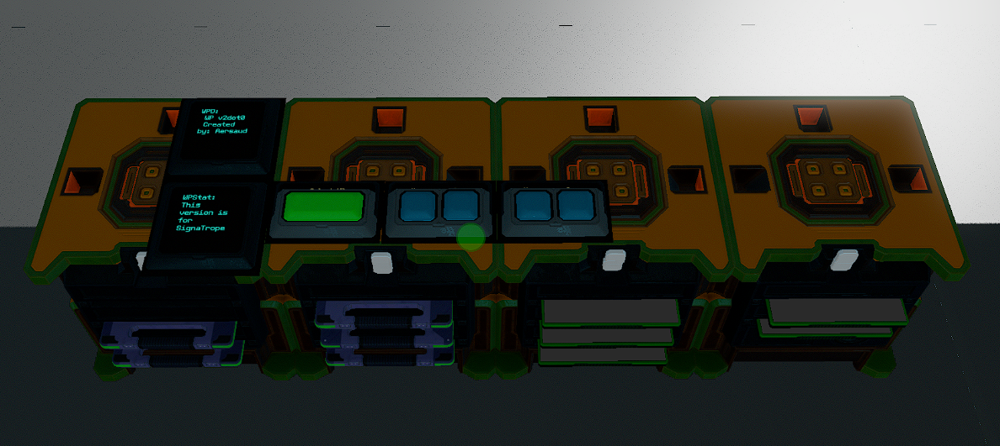

# Waypoint-System v2dot0 (v2.0)

  

Demo Video:

Encryption Version: Coming Soon...

Unsecured Verson:
https://streamable.com/o694c9

  
## Features

- 38 Name Customizable Waypoints (expansion available until your ship has no space - virtually unlimited)
- Built in optional Waypoint Encryption (**ENABLED BY DEFAULT**), using a PIN; with PIN LOCK.
- Visual Waypoint Selection System - You can see the waypoint number prior to parsing/confirming the waypoint for navigation since that is a more time consuming task. If you are running the system in Unsecure mode you will see the Name and Coordinates of the waypoint prior to parsing.
- Save and Overwrite Visual - The system will confirm the Save of a Waypoint on the WPStat screen. If you are overwriting a waypoint you will have 30 seconds (customizable) to confirm that you want to actually Overwrite the waypoint. Home Button = Cancel Overwrite, Save Button= Confirm and Overwrite
- Home Button takes you back to WP1, Up for Incrementing/Moving up your waypoints, Down for Decrementing/Moving down your waypoints, Save for saving, WPC for Loading/Parsing your currently selected waypoint and lastly WPLock for Locking Down the system and clearing your PIN from memory.
- You can press and hold to move faster up or down waypoints. It will wrap when you reach the end or beginning.
- 2 Panels + 6 Buttons for the whole system to function within your cockpit (IPS has an OPTIONAL Text Panel)
- Waypoint Parsing is done on 2 lines total per axis (X,Y,Z). While you are loading a waypoint the selection button will turn red to indicate the loading system is now locked out. When loading/parsing is complete the button will automatically unclick itself and revert to the original green color.
- When saving a Waypoint the Save button will stay depressed until saving is complete.
- Fully compatible with Compass, SignaTrope, and IPS. Make sure you select the correct version for your navigation/coordinate system from the 3 folders available here! The file name will signify the version you are looking at. st_ means SignaTrope c_ means Compass ips_ means IPS. If you are using IPS please pay attention to the README located in that specific subfolder.

*If there are any bugs or issues feel free to submit an Issue here on Github so I can quickly address them.*
*All Waypoint 2.0 code will list the version number and the "MADE FOR" somewhere in the code for easy referencing* 
  
## Full List of Global Variables:

| Global Variable | Type/Use |
| --- | --- |
| wp | Waypoint Loading |
| wpn | Waypoint Number/Index/Slot |
| wpa | Waypoint Saving Assistant |
| wss | Waypoint Saving Index |
| wpe |  Waypoint Encrypt |
| wpde | Waypoint Decrypt |
| wpin | Waypoint PIN |
| wpinsub | Waypoint PIN Submit |
| WPEx | Waypoint Encrypted X |
| WPEy | Waypoint Encrypted Y |
| WPEz | Waypoint Encrypted Z |
| ws | Waypoint Save Button |
| wh | Waypoint Home Button |
| wu | Waypoint Up Button |
| wd | Waypoint Down Button |
| wpc | Waypoint Selection Button |
| wpcc | Waypoint/Lock Button Color |
| wplock| Waypoint Lock Button |
| wp1-wp38 | Waypoints |

*Adding more than 38 Waypoints will also use those global variables.*

## Chip Total and Requirements:

| Name | Type |
| --- | --- |
| eWPC | Advanced |
| WPSave | Advanced |
| WPNSelection | Advanced |
| eWPHUDS | Advanced |
| eWPE | Advanced |
| 5 Memory Chips | N/A |

*Some lines in the chips were intentionally left blank for future use and compatibility.*
*IPS has different chip requirements. If using that system please refer to the README in the IPS folder in this repository.*

## Button/Text Panel Requirements:

| Name | Total | Text Panel/Field Names |
| --- | --- | --- |
| Text Panel 24x24cm | 2 | WPD, WPStat |
| Warning Light Button 12x12cm | 6 | wh, ws, wu, wd, wpc, wplock |

*IPS has the option for a 3rd Text Panel. Please refer to the README in the IPS folder on this repository.*

There are 2 ways to install the Waypoint System. The Preferred Method will be a lot easier for newer people however instructions are available below if you need to install manually.

## Blueprint Install Instruction [Preferred Method]

- I have included a blueprint for each version. To add the blueprint please download it and follow these simple instructions.

1. Open your File Explorer and type in `%AppData%` in the bar at the top
2. Once you are in `%AppData%` scroll down and look for `Starbase` double click the folder to enter 
3. Look for folder `ssc` double click to enter that folder
4. Look for folder `autosave` double click to enter that folder 
5. Look for `ship_blueprints` double click to enter that folder.
6. Put the downloaded file INTO the `ship_blueprints` folder. 
7. You **MUST** RENAME the file 1 number higher than the other files in the folder. 
  - For example if you highest number in the folder is `ship_17593` then you MUST rename this file `ship_17594` (notice the 4 is 1 higher than the 3). This will place the blueprint in your AUTOSAVE list.
8. Load up the AUTOSAVE in the SSC and SAVE it as a new BLUEPRINT if you wish to spawn it In-Game or Save it as a MODULE if you wish to install the system on your ship within the SSC.

**These blueprints have all the YOLOL chips and Memory Chips already loaded up and ready for use. Simply just bolt down the racks run a power cable and put the Text Displays/Buttons in your cockpit.**

**THE SYSTEM WILL HAVE ENCRYPTION ENABLED BY DEFAULT.** If you do not wish to use encryption please set `En=0` in all applicable chips (`eWPC, eWPHUDS, eWPE`), this is always located on the first line.

## Manual/ In-Game Installation Instructions [Hard Way]

*Please refer to the pictures for assistance on field names, and values. These pictures WILL ALWAYS be up-to-date*

-  **THE SYSTEM WILL HAVE ENCRYPTION ENABLED BY DEFAULT.** If you do not wish to use encryption please set `En=0` in all applicable chips (`eWPC, eWPHUDS, eWPE`), this is always located on the first line.
- This system requires 5 Advanced YOLOL chips AND 5 Memory Chips.
- Copy/Insert the code for your appropriate Navigation System into the YOLOL chips.
- Rename the `Chipwait` on `eWPC` to `eWPC` and set the value to `-1`.
- Rename the `Chipwait` on `eWPHUDS` to `eWPHUDS` and set the value to `-1`.
- Rename the `Chipwait` on `eWPE` to `eWPE` and set the value to `0`.
- The other 2 YOLOL chips `WPNSelection` and `WPSave` do not require renaming the `Chipwait` fields or changing the value. They should be `0`. I do however, highly recommend always renaming your `Chipwait` fields to help you identify your chips easier.
- You will need 2 24x24cm Text Panels (IPC has the option for a 3rd Text Panel). One should be named `WPD` and the other `WPStat`
- You will need 6 12x12cm Warning Light Buttons. They should be named `wh` for Home `ws` for Save `wu` for Up  `wd` for Down `wpc` for Waypoint Selection and `wplock` for Waypoint Lock.
  - On the Save (`ws`) and Select (`wpc`) button. Set Button Style to 1.
- You will also need 1 12x24cm Simple Button. This should be named `wpc`
  - Rename the 3rd field on the `wplock` and `wpc` button to `wpcc`.
- Install your FIRST memory chip and edit the 10 required fields. `wp`  `wpc`  `wpn`  `wpa`  `wss`  `wpex`  `wpey`  `wpez`  `wpin`  `wpinsub`
  - Set the value of wpn to 1
  - In the `wp` field make sure the value is `0`.
- The additional 4 memory chips will be used for waypoints AND TWO more Global Variables that we need to make this system functional.
- Install your other 4 memory chips and name the fields in order starting from `wp1` until you finish with the last chip which will contain `wp38`.
- Leave **ALL** the wp1-wp38 fields with the number `0` as the value. The system will update this as you save waypoints.
- In the LAST Memory Chip which contains wp38 you should have 2 fields left, name these `wpe` and `wpde`. These will be used for Encrypting and Decrypting the waypoints.
- To double check yourself take a look at your 5 Memory Chips. Every field should have been renamed and will be used by this system. You will also have a total of 5 Advanced YOLOL chips.
- Even if you are **NOT** using Encryption `wpde` `wpe` `WPEx` `WPEy` `WPEz` are still required on the Memory Chips or the system will not function correctly.

## Installation Pictures (these will ALWAYS be Up-To-Date)

#### WPD

#### WPStat 

#### WPLOCK

#### WPC

#### WH

#### WS

#### WU

#### WD

#### Memory Chip 1

#### Memory Chip 2

#### Memory Chip 3

#### Memory Chip 4

#### Memory Chip 5

## FAQ

### How Long Does My PIN Have to Be?

- Your PIN **MUST** consist of ALL digits (0-9). The length can be whatever you want, however **DO NOT** exceed 6 total digits.

### How Does Encryption Work with this System?

- Encryption is done in the eWPE chip. When you SAVE a set of coordinates (waypoint) it is run through the encryption chip and made into a set of random numbers **DEPENDENT** on your PIN.

### How Do I Use Encryption?

- Encryption **IS ENABLED** on all chips by default. You will notice this with En=1 on the applicable chips (`eWPC, eWPHUDS, eWPE`).
- You must set create a PIN in order for Encryption to work properly. This PIN must be input into the `:wpin` global slot. You can do this via the U-Tool or a Keypad System (of your choice).
- After entering your PIN you must set `wpinsub` to `1`. This will submit the PIN into the chip. One the PIN has been submitted into the chip `wpinsub` and `wpin` are zero'd out.
- The PIN will **NEVER** timeout/wipe automatically. You **MUST** press the `WPLock` button in order to Lock the system.
- After locking the system, you will be required to re-enter your PIN.
- Failure to enter a PIN code will result in Coordinates not Encrypting/Decrypting properly.

### Waypoint Format (on the Memory Chips)

- The waypoint has a specific format that is required to function properly. You will only be touching these if you want to rename your waypoints or if you want to add waypoints in by hand. Adding in Waypoints by hand is currently not implemented but WILL be in a future release.

- The format is as follows `"[Home] X=12345 Y=-12345 Z=-32551"`

That is the name in brackets `[Name]` followed by a SINGLE space. `X=COORDS`  `Y=COORDS`  `Z=COORDS` each axis has a **SINGLE** space between the previous one and the following one.
- You can rename the waypoints whatever you want. Keep in mind if the name is too long it may wrap to the next line on the Text Panel and cause it to show incorrectly.

## Changelog:

v2dot0 (v2.0) Major Release
- Includes Waypoint Encryption
- Faster Parsing time (Loading)

v1.1.1 Minor Release
- Includes compatibility for IPS by Fryke.

v1.1 Major Release
- Added Overwrite Confirmation
- Reduced total Waypoint load time down from 3 lines to 2. This allows loading of waypoints even faster than before.

v1.0.1 Minor Release
- Fixed a bug that was affecting saving of Waypoints.

v1.0
- Initial Release
