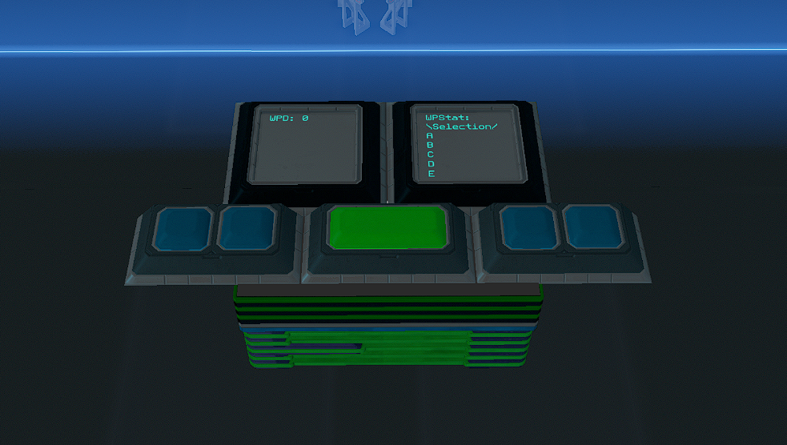

# Waypoint-System v2dot0 (v2.0)

  

Demo Video:

https://streamable.com/o694c9

  
## Features

- 38 Name Customizable Waypoints (expansion available until your ship has no space - virtually unlimited)
- Built in optional Waypoint Encryption (**ENABLED BY DEFAULT**), using a PIN; with PIN LOCKOUT/TIMEOUT
- Visual Waypoint Selection System - You can see the waypoint name and coordinates prior to parsing/confirming the waypoint for navigation since that is a more time consuming task.
- Save and Overwrite Visual - The system will confirm the Save of a Waypoint on the WPStat screen. If you are overwriting a waypoint you will have 30 seconds (customizable) to confirm that you want to actually Overwrite the waypoint. Home Button = Cancel Overwrite, Save Button= Confirm and Overwrite
- Home Button takes you back to WP1, Up for Incrementing/Moving up your waypoints, Down for Decrementing/Moving down your waypoints, Save for saving.
- You can press and hold to move faster up or down waypoints. It will wrap when you reach the end or beginning.
- 2 Panels + 5 Buttons for the whole system to function within your cockpit (IPS has an OPTIONAL Text Panel)
- Waypoint Parsing is done on 3 lines total per axis (X,Y,Z). While you are loading a waypoint the selection button will turn red to indicate the loading system is now locked out. When loading/parsing is complete the button will automatically unclick itself and revert to the original green color.
- Fully compatible with Compass, SignaTrope, and IPS. Make sure you select the correct version for your navigation/coordinate system from the 2 folders available here! The file name will signify the version you are looking at. st_ means SignaTrope c_ means Compass ips_ means IPS. If you are using IPS please pay attention to the README located in that specific subfolder.

*If there are any bugs or issues feel free to submit an Issue here on Github so I can quickly address them.*
  
## Global Variables:

| Global Variable | Requirement |
| --- | --- |
| wp | ALL |
| wpc | ALL |
| wpn | ALL |
| wpa | ALL |
| wss | ALL |
| wp1-wp38 | ALL |
| wpe | ENCRYPTION ONLY |
| wpde | ENCRYPTION ONLY |
| wpin | ENCRYPTION ONLY |
| wpinsub | ENCRYPTION ONLY |
| WPEx | ENCRYPTION ONLY |
| WPEy | ENCRYPTION ONLY |
| WPEz | ENCRYPTION ONLY |

*Adding more than 38 Waypoints will also use those global variables.*

## Chip Total and Requirements:

| Name | Type |
| --- | --- |
| eWPC | Advanced |
| WPSave | Advanced |
| WPNSelection | Advanced |
| eWPHUDS | Advanced |
| eWPE | Advanced |
| 5 Memory Chips | N/A |

*Some lines in the chips were intentionally left blank for future use and compatibility.*

## Button/Text Panel Requirements:

| Name | Total | Text Panel/Field Names |
| --- | --- | --- |
| Text Panel 24x24cm | 2 | WPD, WPStat |
| Simple Button 12x12cm | 4 | wh, ws, wu, wd |
| Simple Button 12x24cm | 1 | wpc |

## Blueprint Install Instruction

- I have included a blueprint for each version. To add the blueprint please download it and open your File Explorer and type in `%AppData%` in the bar at the top; once you are there scroll down and look for `Starbase` double click the folder to enter and look for `ssc` double click to enter and look for folder `autosave` double click on that and look for `ship_blueprints`. You will put this file INTO the `ship_blueprints` folder. You MUST then RENAME the file 1 number higher than the other files in the folder. For example if you highest number in the folder is `ship_17593` then you MUST rename this file `ship_17594` (notice the 4 is 1 higher than the 3). This will place the blueprint in your Autosave list, you can then load this up in the SSC and save it as a new Blueprint if you wish to spawn it In-Game or Save it as a module if you wish to install the system on your ship in the SSC.

## Manual/ In-Game Installation Instructions

*Please refer to the pictures for assistance on field names, and values. These pictures are up to date*

-  **THE SYSTEM WILL HAVE ENCRYPTION ENABLED BY DEFAULT.** If you do not wish to use encryption please set `En=0` in all applicable chips (this is always located on the first line) **AND** do not install eWPE.
- This system requires 5 Advanced YOLOL chips AND 5 Memory Chips.
- Copy/Insert the code for your appropriate navigation system.
- You will need 2 24x24cm Text Panels. One should be named `WPD` and the other `WPStat`
- You will need 4 12x12cm Simple Buttons. They should be named `wh` for Home `ws` for Save `wu` for Up and `wd` for Down
  - On the Save (`ws`) and Select (`wpc`) button. Set Button Style to 1.
- You will also need 1 12x24cm Simple Button. This should be named `wpc`
  - This 12x24cm Simple Button also requires you renaming the 3rd field to `wpcc`
- Install your FIRST memory chip and edit the 10 required fields. `wp`  `wpc`  `wpn`  `wpa`  `wss`  `wpex`  `wpey`  `wpez`  `wpin`  `wpinsub`
  - Set the value of wpn to 1
  - In the `wp` field add the value `"[Home] X=12345 Y=-12345 Z=-32551"` These coordinates can be whatever you want OR you can leave it as 0.
- The additional 4 memory chips will be used for waypoints AND two more global variables that we need.
- Install your other 4 memory chips and name the fields in order starting from `wp1` until you finish with the last chip which will contain `wp38`.
- You can leave all the wp1-wp38 fields with the number 0 as the value. The system will update this as you save waypoints.
- In the last Memory Chip which contains wp38 you should have 2 fields left, name these `wpe` and `wpde`

## Installation Pictures

#### WPD

#### WPStat (the value shown of the field is not necessary to input and the system will handle that)

#### WPC

#### WH

#### WS

#### WU

#### WD

#### Memory Chip 1

#### Memory Chip 2

#### Memory Chip 3

#### Memory Chip 4

#### Memory Chip 5

## FAQ

### How Does Encryption Work

- Encryption is done in the eWPE chip. When you SAVE a set of coordinates (waypoint) it is run through the encryption chip and made into a set of random numbers **DEPENDENT** on your PIN.

### How to Use Encryption

- By default Encryption **IS ENABLED** on all chips by default. You will notice this with En=1 on the applicable chips.
- You must set create a PIN in order for Encryption to work properly. This PIN must be input into the `:wpin` global slot. You can do this via the U-Tool or a Keypad system.
- By default the PIN will have a timeout of 5 minutes. This means after 5 minutes you will have to enter the PIN again in order to successfully ENCRYPT and DECRYPT waypoints. Failure to enter the PIN after the lockout period will cause your waypoints to not ENCRYPT or DECRYPT properly.
- You can remove the PIN lockout time by setting `a=0` in the `eWPE` chip. The lockout time can be changed by changing `a` to ANY value. Keep in mind EACH YOLOL tick is ~0.2 seconds so set your value appropriately for the time you want. I.e. 5 minutes is 15000.
- After entering your PIN you must set `wpinsub` to `1`. This will submit the PIN into the chip.

### Waypoint Format (on the Memory Chips)

- The waypoint has a specific format that is required to function properly. You will only be touching these if you want to rename your waypoints or if you want to add waypoints in by hand. The format is as follows `"[Home] X=12345 Y=-12345 Z=-32551"`
That is the name in brackets `[Name]` followed by a SINGLE space. `X=COORDS`  `Y=COORDS`  `Z=COORDS` each axis has a SINGLE space between the previous one and the following one.
- You can rename the waypoints whatever you want. Keep in mind if the name is too long it may wrap to the next line on the text panel and cause it to show incorrectly.
- Currently there is no way to encrypt waypoints manually to work with this system. This will come in a future update. However, if you are encrypting feel free to rename your waypoints.

## Changelog:

v2dot0 (v2.0) Major Release
- Includes Waypoint Encryption
- Faster Parsing time (Loading)

v1.1.1 Minor Release
- Includes compatibility for IPS by Fryke.

v1.1 Major Release
- Added Overwrite Confirmation
- Reduced total Waypoint load time down from 3 lines to 2. This allows loading of waypoints even faster than before.

v1.0.1 Minor Release
- Fixed a bug that was affecting saving of Waypoints.

v1.0
- Initial Release
