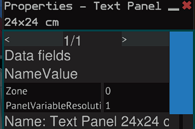
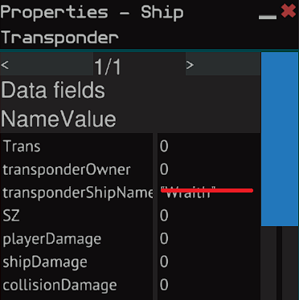
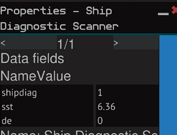

# Ship States

Requirements:

* Basic YOLOL Chip
* Transponder
* Ship Diagnostic Scanner

Field Names:

Transponder

* Field One = Trans
* Field Four = SZ

Ship Diagnostic Scanner

* Field One = 1
* Field Two = sst
* Field Three = de

Text Panel

* Field One = Zone

Below are how you should name the fields in these devices.

Text Panel

Transponder

Ship Diagnostic Scanner

