# Waypoint-System v2dot0 (v2.0)

  

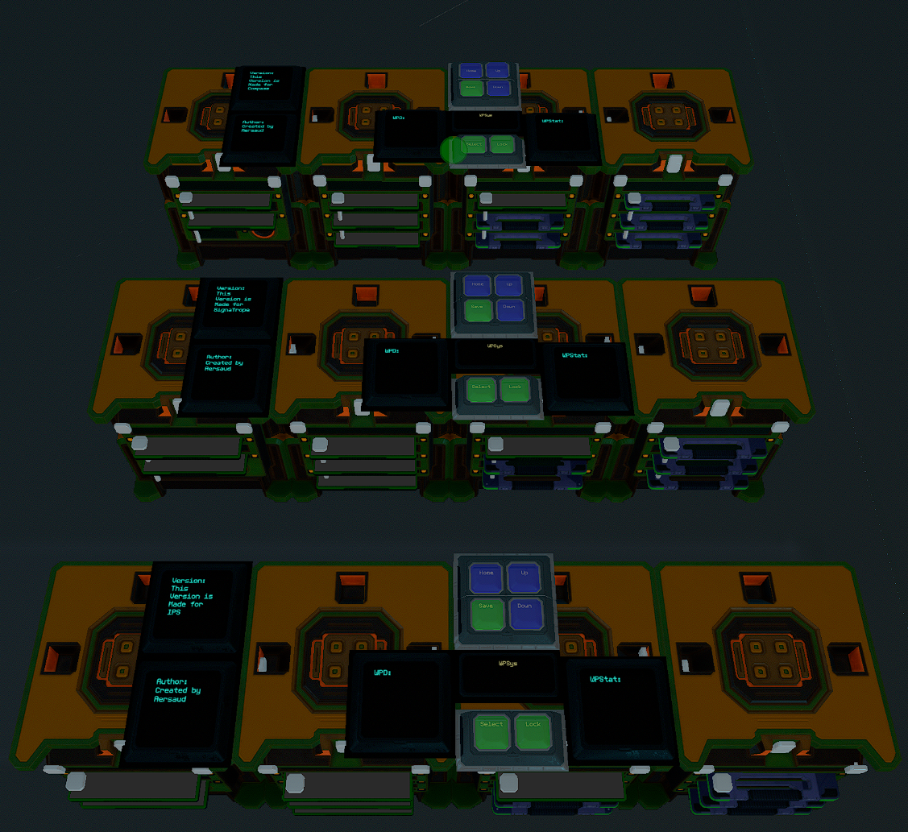

Demo Videos:

Encryption Version:
https://www.youtube.com/watch?v=z9JFBizFcpc

Unsecured Verson:
https://www.youtube.com/watch?v=Hde5HFqa-hA

**Updating from a PREVIOUS version? Make sure you READ [THIS](#READ-CAREFULLY-BEFORE-UPDATING-FROM-A-PREVIOUS-VERSION)**

**Having an issue with the system? Please go through the [FAQ's](#faqimportant-information) before opening an Issue here on Github or contacting me via Discord!**

  
## Features

- Easy Installation via Blueprint. Print a copy of the blueprint in game bolt it your ship and wire it for power or place it in the SSC. Manual installation instructions are also available!
- 38 Name Customizable Waypoints (expansion available until your ship has no space - virtually unlimited)
- Manual Entry of Waypoints and Names supported on the WPSys progress bar!
- Built in optional Waypoint Encryption (**ENABLED BY DEFAULT**), using a PIN (**6 DIGITS MAX**); with LOCK button.
- Visual Waypoint Selection System - You can see the waypoint slot number prior to parsing/confirming the waypoint for navigation since that is a more time consuming task. If you are running the system in Unsecure Mode you will see the Name and Coordinates of the waypoint prior to parsing.
- Save and Overwrite Visual - The system will confirm the Save of a Waypoint on the WPStat screen. If you are overwriting a waypoint you will have 30 seconds (customizable) to confirm that you want to actually Overwrite the waypoint. Home Button = Cancel Overwrite, Save Button= Confirm and Overwrite. If you are doing this from the WPSys progress bar you will be using 1 or 0 to say Yes or No to all the questions regarding overwritting.
- Home Button takes you back to WP1, Up for Incrementing/Moving up your waypoints, Down for Decrementing/Moving down your waypoints, Save for saving, WPC for Loading/Parsing your currently selected waypoint and lastly WPLock for Locking Down the system and clearing your PIN from memory.
- 1 Progress Bar + 2 Text Panels + 6 Warning Light Buttons for the whole system to function within your cockpit (IPS has an OPTIONAL Text Panel)
- System LockOut - Whenever the system is LOCKED such as loading a waypoint, saving a waypoint, or locked due to the Lock button. Various buttons within the system will turn RED to show you they will not function. During LockOut due to the Lock button being used no buttons will function until a valid PIN is entered in the `wpin` field and `wpinsub` is set to 1.
- Fully compatible with Compass, SignaTrope, and IPS. Make sure you select the correct version for your navigation/coordinate system from the 3 folders available here! The file name will signify the version you are looking at. st_ means SignaTrope c_ means Compass ips_ means IPS. If you are using IPS please pay attention to the README located in that specific subfolder.
- Waypoint Loading now parses DECIMALs as well. For 100% accuracy regardless of Encryption Mode or Unsecure Mode.

*If there are any major bugs or issues feel free to submit an Issue here on Github so I can quickly address them.*
*All Waypoint 2.0 code will list the version number and the "MADE FOR" somewhere in the code for easy referencing* 
*The previous version is still available in the PREVIOUS VERSIONS folder.* 

## Table of Contents
- [Global Variable List](#full-list-of-global-variables-(including-buttons-and-progress-bar-fields))
- [Chip Total and Requirements](#chip-total-and-requirements)
- [NON-YOLOL Device Requirements](#non-yolol-device-requirements)
- [Waypoint Format](#waypoint-format)
- [Updating from a Previous Version](#READ-CAREFULLY-BEFORE-UPDATING-FROM-A-PREVIOUS-VERSION)
- [Installation Instructions](#installation-instructions)
- [Installation Pictures](#installation-pictures-these-will-always-be-up-to-date)
- [Manual Import Process](#manual-import-process)
- [FAQ/Important Information](#faqimportant-information)
- [Changelog](#changelog)

  
## Full List of Global Variables (Including Buttons and Progress Bar Fields):

I have tried to keep everything within the same name space (`wp` and `w` for buttons), please make sure you have nothing else writing to these values or named the same on your ship.

| Global Variable | Name/Use | Where Is It? |
| --- | --- | --- |
| wp | Waypoint Loading | Memory Chip |
| wpes | Waypoint Encryption Sync | Memory Chip |
| wpn | Waypoint Number/Index/Slot | Memory Chip |
| wpa | Waypoint Saving Assistant | Memory Chip |
| wss | Waypoint Saving Index | Memory Chip |
| wps | Waypoint Selection Index | Memory Chip |
| wpe |  Waypoint Encrypt | Memory Chip |
| wpde | Waypoint Decrypt | Memory Chip |
| wpin | Waypoint PIN | Progress Bar |
| wpinsub | Waypoint PIN Submit | Progress Bar |
| wpent | Waypoint Manual Entry/Response System  | Progress Bar |
| wpsys | Waypoint Progress Bar Name | Progress Bar |
| WPEx | Waypoint Encrypted X | Memory Chip |
| WPEy | Waypoint Encrypted Y | Memory Chip |
| WPEz | Waypoint Encrypted Z | Memory Chip |
| ws | Waypoint Save Button | Button |
| wh | Waypoint Home Button | Button |
| wu | Waypoint Up Button | Button |
| wd | Waypoint Down Button | Button |
| wpc | Waypoint Selection Button | Button |
| wpcc | Waypoint Selection/Lock Button Color | Button |
| wplock| Waypoint Lock Button | Button |
| eWPC | Chipwait for eWPC chip | YOLOL Chipwait Field |
| eWPHUDS | Chipwait for eWPHUDS | YOLOL Chipwait Field |
| eWPE | Chipwait for eWPE | YOLOL Chipwait Field |
| eWPNSelection | Chipwait for eWPNSelection | YOLOL Chipwait Field |
| eWPSave | Chipwait for eWPSave | YOLOL Chipwait Field |
| eWPSys | Chipwait for eWPSys | YOLOL Chipwait Field |
| wp1-wp38 | Waypoints | Memory Chip |

*Adding more than 38 Waypoints will also use those global variables.*

## Chip Total and Requirements:

| Name | Type |
| --- | --- |
| eWPC | Advanced |
| eWPSave | Advanced |
| eWPNSelection | Advanced |
| eWPHUDS | Advanced |
| eWPE | Advanced |
| eWPSys | Advanced |
| 5 Memory Chips | N/A |

*Some lines in the chips were intentionally left blank for future use and compatibility.*

*IPS has different chip requirements. If using that system please refer to the README in the IPS folder in this repository.*

## Non-YOLOL Device Requirements:

| Name | Total | Text Panel/Field Names |
| --- | --- | --- |
| Progess Bar 12x24cm | 1 | WPSys, wpent, wpin, wpinsub |
| Text Panel 24x24cm | 2 | WPD, WPStat |
| Warning Light Button 12x12cm | 6 | wh, ws, wu, wd, wpc, wplock |

*IPS has the option for a 3rd Text Panel. Please refer to the README in the IPS folder on this repository.*

## Waypoint Format

- The waypoint has a specific format that is required to function properly. You will only be using this if you want to rename your waypoints or if you want to add waypoints in by hand using WPSys (such as Importing or Manual Entry).

- The format is as follows `"[Home] X=12345 Y=-12345 Z=-32551"`

That is the name in brackets `[Name]` followed by a SINGLE space. `X=COORDS`  `Y=COORDS`  `Z=COORDS` each axis has a **SINGLE** space between the previous one and the following one. There are no spaces between the axis name, the equal sign, and the coordinate numbers. Please see the DEMO videos if you have questions.
- You can rename the waypoints whatever you want. Keep in mind if the name is too long it may wrap to the next line on the Text Panel and cause it to show incorrectly.

## READ CAREFULLY BEFORE UPDATING FROM A PREVIOUS VERSION
- Waypoint 2dot0 (v2.0) is not 100% compatible with the previous version. *What does this mean?*
- If you try to Load/Parse an Unencrypted waypoint while your waypoint system is in Encryption Mode (which it will be by Default) the waypoint will **NOT** load properly. 
- What can you do about this? You can import the waypoint back into the system to be encrypted and saved! 

## Manual Import Process

1. Select the slot you are going to be converting to Waypoint 2dot0 (v2.0) USING the Up/Down buttons.

2. Go to the memory chip and copy the contents of that slot. For example if I am importing slot 2 I would copy what is on the memory chip field for `wp2`. Let's say my `wp2` contains `"[Base1] X=12345.123 Y=-12345.2 Z=9876.432"` for this example.

3. Use the WPSys progress bar to LOAD that Waypoint by entering it in `wpent` (you can copy and paste this for simplicity). So in my case I would paste in `"[Base1] X=12345.123 Y=-12345.2 Z=9876.432"`

4. After the WPSys is done loading you will be prompted to Save. Enter 1 in `wpent` to Save.

5. It will ask for confirmation to OVERRIDE your slot number. Make sure this matches your SLOT which you are importing. Enter 1 in `wpent` to save. 

6. After the waypoint has been encrypted it will be saved into the slot. Congratulations! you now have an encrypted functional Waypoint 2dot0 (v2.0) waypoint.

## Installation Instructions

There are 2 ways to install the Waypoint System. The Preferred Method is the EASIEST install, however instructions are available below if you need to install manually.

## Blueprint Install Instruction [Preferred Method]

**I have included a blueprint for each version. To add the blueprint please download from the subfolder associated with your Navigation System and follow these simple instructions below for installation. These blueprints have all the YOLOL Chips and Memory Chips already loaded up and ready for use. Simply just bolt down the racks run a power cable and put the Text Displays/Buttons/Progress Bar in your cockpit.**

1. Open your File Explorer and type in `%AppData%` in the bar at the top
2. Once you are in `%AppData%` scroll down and look for `Starbase` double click the folder to enter 
3. Look for folder `ssc` double click to enter that folder
4. Look for folder `autosave` double click to enter that folder 
5. Look for `ship_blueprints` double click to enter that folder.
6. Put the downloaded file INTO the `ship_blueprints` folder. 
7. You **MUST** RENAME the file 1 number higher than the other files in the folder. 
    - For example if you highest number in the folder is `ship_17593` then you MUST rename this file `ship_17594` (notice the 4 is 1 higher than the 3). This will place the blueprint in your AUTOSAVE list.
8. Load up the AUTOSAVE in the SSC and SAVE it as a new BLUEPRINT if you wish to spawn it In-Game or Save it as a MODULE if you wish to install the system on your ship within the SSC.

**THE SYSTEM WILL HAVE ENCRYPTION ENABLED BY DEFAULT.** If you do not wish to use encryption please set `En=0` in all applicable chips (`eWPC, eWPHUDS, eWPE, eWPSys`), this is always located on the first line of each applicable chip.

## Manual/ In-Game Installation Instructions [Hard Way]

*Please refer to the pictures for assistance on field names, and values. These pictures WILL ALWAYS be up-to-date*

-  **THE SYSTEM WILL HAVE ENCRYPTION ENABLED BY DEFAULT.** If you do not wish to use encryption please set `En=0` in all applicable chips (`eWPC, eWPHUDS, eWPE, eWPSys` ), this is always located on the first line of each applicable chip.
- This system requires 6 Advanced YOLOL chips AND 5 Memory Chips.
- Copy/Insert the code for your appropriate Navigation System into the YOLOL chips. For example if I am using SignaTrope I would make sure I am using all the 5 files that start with `st_`
- Rename the `Chipwait` on `eWPC` to `eWPC` and set the value to `-1`.
- Rename the `Chipwait` on `eWPHUDS` to `eWPHUDS` and set the value to `-1`.
- Rename the `Chipwait` on `eWPE` to `eWPE` and set the value to `0`.
- Rename the `Chipwait` on `eWPSys` to `eWPSys` and set the value to `0`.
    - The other 2 YOLOL chips `WPNSelection` and `WPSave` do not require renaming the `Chipwait` fields or changing the value. They should be `0`. I do however, highly recommend always renaming your `Chipwait` fields to help you identify your chips easier.
- You will need **1** 12x24cm Progress Bar.
    - Name the first field of the Progress Bar `WPSys` with a value of `""`
    - Name the second field of the Progress bar to `wpent` with a value of `""`
    - Name the third field of the Progress bar to `wpin` with a value of `0`
    - Name the fourth field of the Progress bar to `wpinsub` with a value of `0`
- You will need **2** 24x24cm Text Panels (IPC has the option for a 3rd Text Panel). 
    - Name your first Text Panel `WPD`
    - Name your second Text Panel `WPStat`
    - Values for both Fields can be `""`
- You will need **6** 12x12cm Warning Light Buttons. 
    - Name the first button `wh`. Button color does not matter, Button style 0. This is your HOME button. 
    - Name the second button `ws`. Name the button color field `wpcc`. Button style 1. This is your SAVE button.
    - Name the third button `wu`. Button color does not matter. Button style 0. This is your UP button.
    - Name the fourth button `wd`. Button color does not matter. Button style 0. This is your DOWN button.
    - Name the fifth button `wpc`. Name the button color field `wpcc`. Button style 1. This is your SELECTION button.
    - Name the sixth button `wplock`. Name the button color field `wpcc`. Button style 0. This is your LOCK button.
    
    *Feel free to use some Progress Bars behind the buttons as labels. (The blueprints come with these by default.)*

- Install your FIRST memory chip and edit the first **9**  fields. `wp` `wpes`  `wpn`  `wpa`  `wss`  `wpex`  `wpey`  `wpez`  `wps` 
  - Set the value of wpn to 1, the rest of the values should be 0.
- The additional 4 memory chips will be used for waypoints AND TWO more Global Variables that we need to make this system functional.
- Install your other 4 memory chips and name the fields in order starting from `wp1` until you finish with the last chip which will contain `wp38`.
- Leave **ALL** the wp1-wp38 fields with the number `0` as the value. The system will update this as you save waypoints.
- In the LAST Memory Chip which contains wp38 you should have 2 fields left, name these `wpe` and `wpde`. These will be used for Encrypting and Decrypting the waypoints.
- To double check yourself there should be only **1** field ithout a name on the **5** Memory Chips. We will not be using that with this version of the system.
- Even if you are **NOT** using Encryption `wpde` `wpe` `WPEx` `WPEy` `WPEz` are still required on the Memory Chips or the system will not function correctly.

## Installation Pictures (these will ALWAYS be Up-To-Date)

#### WPD

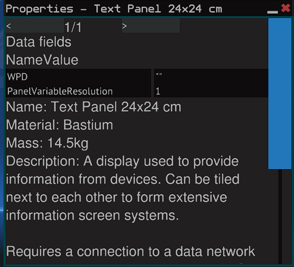

#### WPStat 

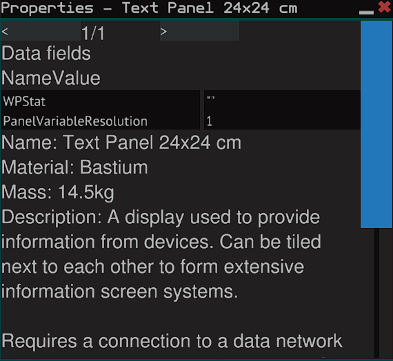

#### WPSys 

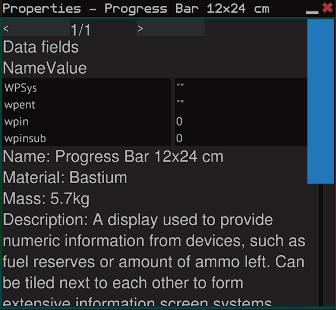

#### WPLock

#### WPC

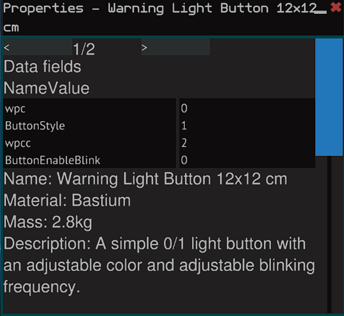

#### WH

#### WS

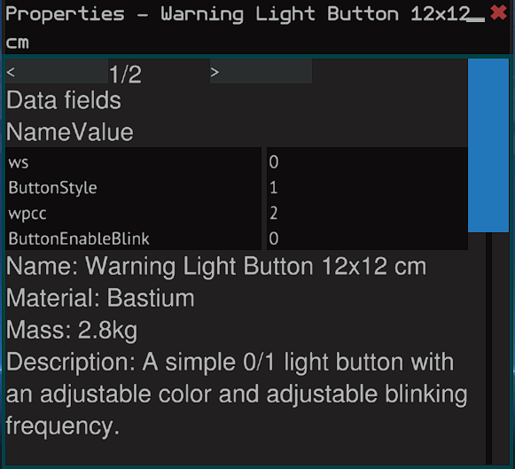

#### WU

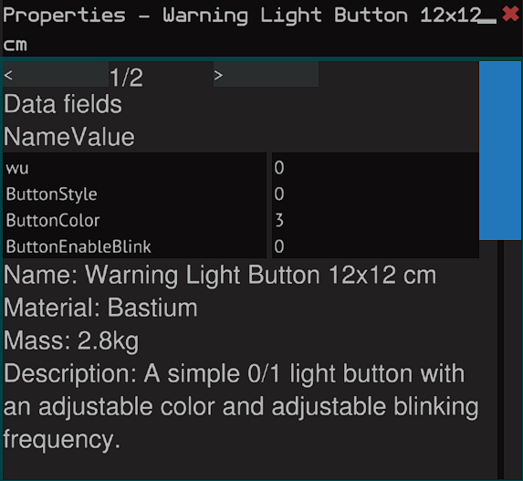

#### WD

#### Memory Chip 1

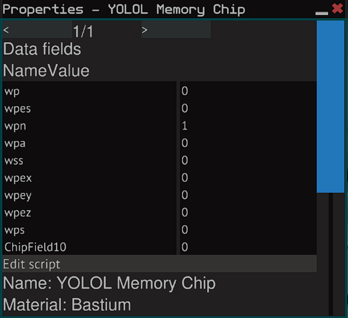

#### Memory Chip 2

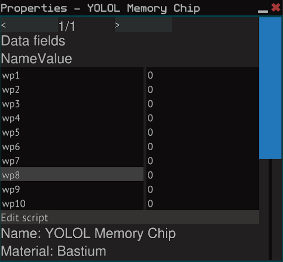

#### Memory Chip 3

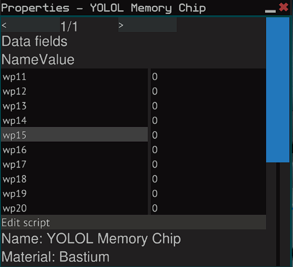

#### Memory Chip 4

#### Memory Chip 5

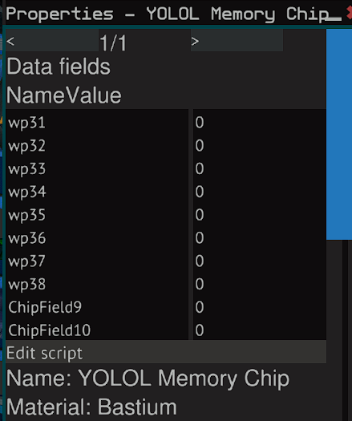

## FAQ/Important Information

### How Long Does My PIN Have to Be?

- Your PIN **MUST** consist of ALL digits (0-9). The length can be whatever you want, however **DO NOT** exceed 6 total digits or you will run into overflow problems when encrypting/decrypting.

### How Does Encryption Work with this System?

- Encryption is done in the eWPE chip. When you SAVE a set of coordinates (waypoint) it is run through the encryption chip and made into a set of random numbers **DEPENDENT** on your PIN.

### How Do I Use Encryption?

- Encryption **IS ENABLED** on all chips by default. You will notice this with En=1 on the applicable chips (`eWPC, eWPHUDS, eWPE`).
- You must set create a PIN in order for Encryption to work properly. This PIN must be input into the `:wpin` global slot. You can do this via the U-Tool or a Keypad System (of your choice).
- After entering your PIN you must set `wpinsub` to `1`. This will submit the PIN into the chip. One the PIN has been submitted into the chip `wpinsub` and `wpin` are zero'd out.
- The PIN will **NEVER** timeout/wipe automatically. You **MUST** press the `WPLock` button in order to Lock the system.
- After locking the system, you will be required to re-enter your PIN.
- Failure to enter a PIN code will result in Coordinates not Encrypting/Decrypting properly.

### Is the Encryption foolproof?

- Within the limits of YOLOL it will be VERY difficult for anyone to crack the encryption due to how slow YOLOL runs. It may be possible for people to crack the encryption outside of Starbase. However, there is nothing we can do to stop that from happening.

### Select Faster!

- You can press and hold to move faster up or down waypoints. It will wrap when you reach the end or beginning.

### My Button is Staying Pressed!

- When saving a Waypoint the Save button will stay pressed until saving is complete.
- When loading a Waypoint the WPC button will stay pressed and turn RED until loading is complete. This indicates the loading system is locked out. The color will return to green once loading is complete.

### HELP! My waypoint system is not working!

- First,  double checking that **ALL** the required global variables are in the Memory Chips.
- Second, double check that **ALL** the required buttons are bolted to your ship somewhere. Use the `U-Tool` in game to make sure they are receiving data and have network access. If you press U when selecting the button and you do not see a flow of data, then your button is not connected to the network and will not function.
- Third, make sure you are using the **CORRECT** waypoint code for your navigation system. If you use the wrong code for your Navigation system you will have multiple syntax errors due to global variables missing that the system is expecting to see.
- If you have exhausted all troubleshooting methods please feel free to open up an Issue report here on Github or post in the official Starbase discord #yolol-code section. Feel free to tag me so I can further assist with troubleshooting.

### My Waypoint system is running slow!

- If you are using Encryption it takes additional time to Encrypt/Decrypt your waypoint. Encryption can take up to an additional 2 seconds while saving, and Decrypting an Encrypted waypoint can take up to 10 seconds. This is the tradeoff that is required when using Encryption in YOLOL.
- If you require speed when Loading/Saving waypoints you will be much happier running the system in Unsecure mode.

### How do I convert my waypoints from the previous version that did not have encryption?

- Please read [Manual Import Process](#manual-import-process)

### How do I type in a specific set of coordinates to navigate to?

- Please read [Manual Import Process](#manual-import-process)

### I'm using Unsecure Mode, Why Do I Need the WPLock button? 

- You don't! However, this button may be used in a future. 

## Changelog:

v2dot0 (v2.0) Major Release
- Includes Waypoint Encryption
- Faster Parsing time (Loading)
- Add WPSys which allows for Manual Entry of Coordinates, and Importing unencrypted waypoints.

v1.1.1 Minor Release
- Includes compatibility for IPS by Fryke.

v1.1 Major Release
- Added Overwrite Confirmation
- Reduced total Waypoint load time down from 3 lines to 2. This allows loading of waypoints even faster than before.

v1.0.1 Minor Release
- Fixed a bug that was affecting saving of Waypoints.

v1.0
- Initial Release
