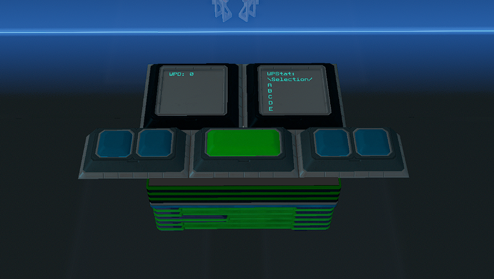

# Waypoint-System v1.1.0

Demo Video: 
https://streamable.com/o694c9

## Features
- 38 Name Customizable Waypoints (expansion available until your ship has no space - virtually unlimited)
- Visual Waypoint Selection System - You can see the waypoint name and coordinates prior to parsing/confirming the waypoint for navigation since that is a more time consuming task.
- Save and Overwrite Visual - The system will confirm the Save of a Waypoint on the WPStat screen. If you are overwriting a waypoint you will have 30 seconds (customizable) to confirm that you want to actually Overwrite the waypoint. Home Button = Cancel Overwrite, Save Button= Confirm and Overwrite
- Home Button takes you back to WP1, Up for Incrementing/Moving up your waypoints, Down for Decrementing/Moving down your waypoints, Save for saving.
- You can press and hold to move faster up or down waypoints. It will wrap when you reach the end or beginning.
- 2 Panels + 5 Buttons for the whole system to function within your cockpit.
- Waypoint Parsing is done on 3 lines total per axis (X,Y,Z). While you are loading a waypoint the selection button will turn red to indicate the loading system is now locked out. When loading/parsing is complete the button will automatically unclick itself and revert to the original green color.
- Fully compatible with Compass and SignaTrope. Make sure you select the correct version for your navigation/coordinate system from the 2 folders available here! The file name will signify the version you are looking at. st_ means SignaTrope c_ means Compass 

*If there are any bugs or issues feel free to submit an Issue here on Github so I can quickly address them.*
 
 

### Global Variables:
| Global Variable          |
|      ---                 |
| 
wp
      | 
| 
wpc
     |
| 
wpn
     |
| 
wpa
     |
| 
wss
     |
| 
wp1-wp38
  |

*Adding more than 38 Waypoints will also use those global variables.*
 
 

### Chip Total and Requirements:
| 
Name           | Type  
    |
| --- | --- |
| 
WPC            | Advanced 
 |
| 
WPSave         | Advanced 
 |
| 
WPNSelection   | Advanced 
 |
| 
WPHUDS         | Basic    
 |
| 
5 Memory Chips | N/A      
 |

*Some lines in the chips were intentionally left blank for future use and compatibility.*
 
 

### Button/Display Requirements:
| 
 Name                  | Total 
 | Text Panel/Field Names |
| --- | --- | --- |
| 
 Text Panel 24x24cm    | 2     
 | WPD and WPStat        |
| 
 Simple Button 12x12cm | 4     
 | wh ws wu wd           |
| 
 Simple Button 12x24cm | 1     
 | wpc                   |

 
 

## Installation Instructions

- This system requires 3 Advanced YOLOL chips, 1 Basic(or higher) YOLOL chip, and 5 Memory Chips.
- Copy/Insert the code for your appropriate navigation system.
- You will need 2 24x24cm Text Panels. One should be named `WPD` and the other `WPStat`
- You will need 4 12x12cm Simple Buttons. They should be named `wh` for Home `ws` for Save `wu` for Up and `wd` for Down
- You will also need 1 12x24cm Simple Button. This should be named `wpc`
  - This 12x24cm Simple Button also requires you renaming the 3rd field to `wpcc`
- On the Save (`ws`) and Select (`wpc`) button. Set Button Style to 1.
- Install your FIRST memory chip and edit the 5 required fields. `wp` `wpc` `wpn` `wpa` `wss`
- In the `wp` field add the value `"[Home] X=12345 Y=-12345 Z=-32551"` These coordinates can be whatever you want.
  - The additional 4 memory chips will be used for waypoints.
- Install your other 4 memory chips and name the fields in order starting from `wp1` until you finish with the last chip which will contain `wp38` there will be some empty space on the FIRST memory chip and the LAST memory chip. These will not be used by this system and you can feel free to use those empty fields.
- You can leave all the wp1-wp38 fields with the number 0 as the value. The system will update this as you save waypoints.
 
 

### Installation Pictures

WPD
[WPD](./InstallationPictures/WPD.png)
WPStat
[WPStat](./InstallationPictures/WPStat.png)
WH
[WH](./InstallationPictures/WH.png)
WS
[WH](./InstallationPictures/WS.png)
WU
[WH](./InstallationPictures/WU.png)
WD
[WH](./InstallationPictures/WD.png)
Memory Chip 1
[WH](./InstallationPictures/MEMC1.png)
Memory Chip 2
[WH](./InstallationPictures/MEMC2.png)
Memory Chip 3
[WH](./InstallationPictures/MEMC3.png)
Memory Chip 4
[WH](./InstallationPictures/MEMC4.png)
Memory Chip 5
[WH](./InstallationPictures/MEMC5.png)

## Changelog:
v1.1
- Added Overwrite Confirmation
- Reduced total Waypoint load time down from 3 lines to 2. This allows loading of waypoints even faster than before.
v1.0.1
- Fixed a bug that was affecting saving of Waypoints.

